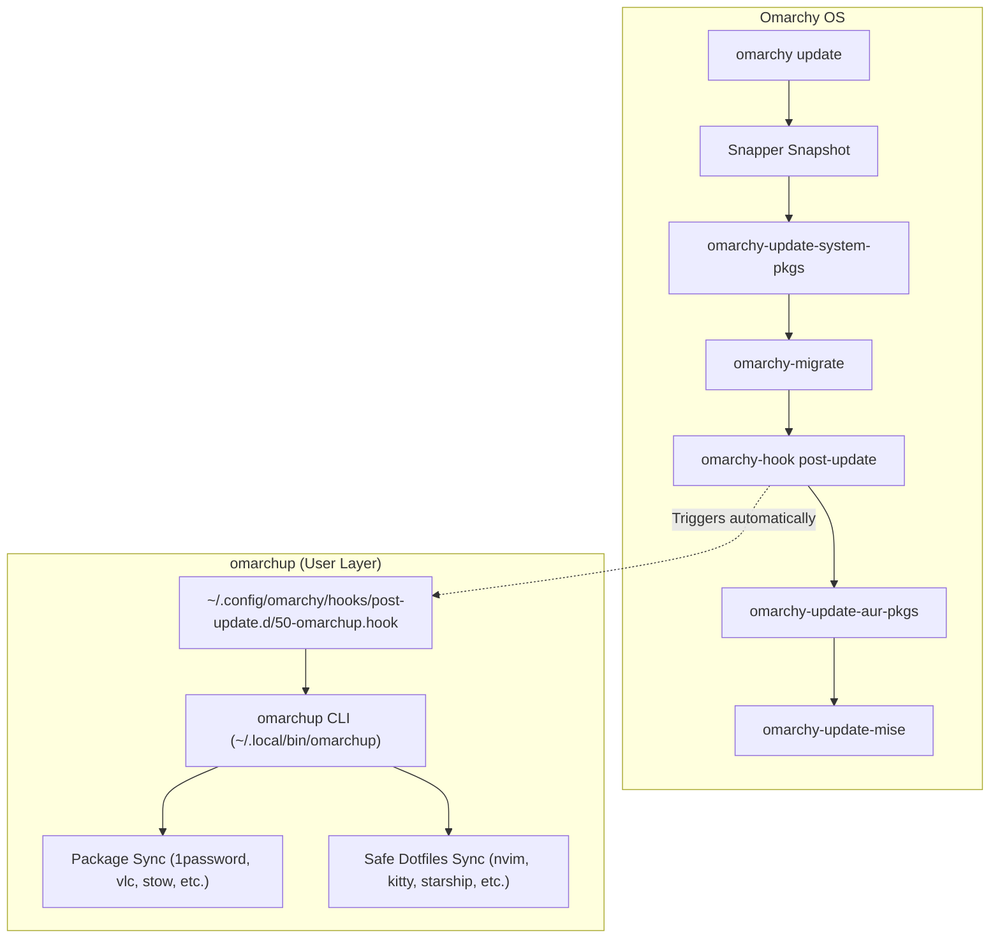

# Omarchup (omarchyup)

Personal add-on, package manifest, and dotfiles management layer tailored specifically for **[Omarchy OS](https://omarchy.org/)**.

Inspired by and evolved from [archup](file:///home/enrique/Work/archup), `omarchup` is redesigned from the ground up to cooperate with Omarchy's architecture rather than fighting or overriding it.

---

## Why Omarchup? (archup vs omarchup)

| Feature / Area | Original `archup` | `omarchup` (on Omarchy OS) |
| :--- | :--- | :--- |
| **Philosophy** | Standalone OS bootstrap script | Add-on layer for existing Omarchy OS |
| **Package Installer** | Custom shell loops around raw `yay -S` | Omarchy native `omarchy pkg add` / `omarchy pkg aur add` |
| **System Update** | `yay -Syu --noconfirm` (skips snapshots) | Integrates with `omarchy update` (Snapper snapshots + migrations) |
| **Hook Integration** | None (manual execution only) | Native Omarchy hook in `~/.config/omarchy/hooks/post-update.d/` |
| **Desktop Shell** | Installs & stows Waybar, Wofi, SwayNC | Protects Omarchy's native Quickshell (`omarchy-shell`) |
| **Hyprland** | Stows traditional `hyprland.conf` | Respects Omarchy's Lua configuration (`~/.config/hypr/*.lua`) |
| **Shell Environment**| Overwrites `~/.bashrc` | Preserves Omarchy's `env-bootstrap` and default aliases |

---

## Architecture



---

## Project Structure

```
~/Work/omarchup/
├── bin/
│   └── omarchup            # Primary executable CLI runner
├── config/
│   ├── packages.conf       # Declarative manifest of personal packages
│   └── dotfiles.conf       # Dotfiles git repository URL & stow module list
├── lib/
│   ├── colors.sh           # Visual formatting, banner, and logger
│   ├── packages.sh         # Package installer using omarchy pkg
│   ├── dotfiles.sh         # GNU Stow manager with Omarchy safety guards
│   └── hook.sh             # Omarchy hook integration manager
├── hooks/
│   └── 50-omarchup.hook    # Post-update hook definition
├── install.sh              # Links 'omarchup' & 'omarchyup' into ~/.local/bin
└── README.md
```

---

## Quick Start

### 1. Install CLI Symlinks
Run the installer to link `omarchup` and `omarchyup` into `~/.local/bin`:
```bash
cd ~/Work/omarchup
./install.sh
```

### 2. Check Current Status
Inspect the status of configured packages, dotfiles, and hooks:
```bash
omarchup status
```

### 3. Sync Packages & Dotfiles
Run a full sync (installs missing packages like `1password`, `vlc`, `stow` and stows safe dotfiles):
```bash
omarchup sync
```

### 4. Enable Automatic Sync with System Updates
Register `omarchup` into Omarchy's post-update lifecycle:
```bash
omarchup hook install
```
Now, whenever you run `omarchy update`, your personal packages and dotfiles will be verified and kept in sync automatically!

---

## Commands

| Command | Description |
| :--- | :--- |
| `omarchup` or `omarchup sync` | Synchronize personal packages and safe dotfiles |
| `omarchup packages [sync\|status]` | Manage personal packages (`sync` or `status`) |
| `omarchup dotfiles [sync\|status]` | Manage dotfiles (`sync`, `status`, `--force`) |
| `omarchup hook [install\|remove\|status]` | Manage Omarchy post-update hook integration |
| `omarchup status` | Display overview of packages, dotfiles, and hooks |
| `omarchup update` | Runs `omarchy update`, followed by `omarchup sync` |
| `omarchup help` | Display help and usage instructions |

---

## Configuration

### Packages (`config/packages.conf`)
Add or remove packages in [config/packages.conf](file:///home/enrique/Work/omarchup/config/packages.conf):
```bash
# Personal Applications
APPS=(
  1password             # From Omarchy official repository
  vlc                   # Media player
  vlc-plugin-upnp       # UPnP playback plugin
)

# Development & Shell Tools
DEV_TOOLS=(
  direnv
  keychain
  v4l-utils
)
```

### Dotfiles (`config/dotfiles.conf`)
Configure which modules are stowed from your dotfiles repository in [config/dotfiles.conf](file:///home/enrique/Work/omarchup/config/dotfiles.conf):
- **`SAFE_MODULES`**: Stowed automatically (`nvim`, `kitty`, `starship`, `editorconfig`, `tmux`, `backgrounds`, `alacritty`).
- **`DISABLED_MODULES`**: Excluded by default (`hyprland`, `waybar`, `wofi`, `bash_arch`) to preserve Omarchy OS's native desktop shell and environment.
